# AirlineTicketBookingSystem
It is a web application that built on Java and Spring MVC.
It's using JSP, HTML, JS, and CSS for the View part.
MySQL is the backend for database.
Apache Tomcat as deployment server. 
The features of the applications are Admin side and User side these two are the main actors.
The Admin can view/ add/ delete/ update new flight details. Admin can check the booking record of the users and can allocate seat numbers for the booked tickets. Admin can change the flight time, date and amount accordingly. 
User can search flights entering the source and destination city and the date of travel. User can register in the web application with some basic details like name, phone number, email id. A user can search for flights but needs to log in to book flights. A user can book flights with additional passengers. A user can see their booked flight details in his home page. After completing the payment the user can print ticket details page.

## screenshots of user flow

Home Page
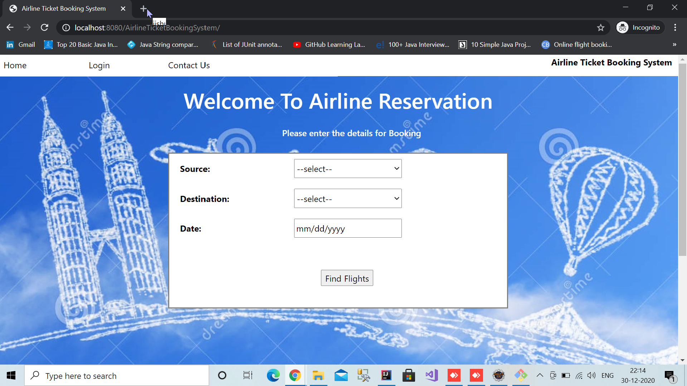

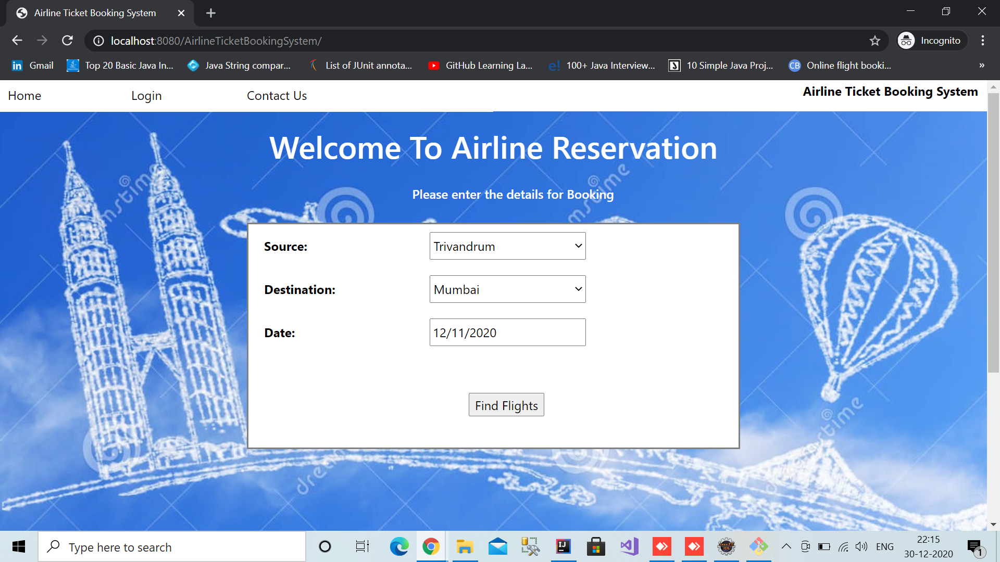

`Find Flights` Button click navigates to flight info page
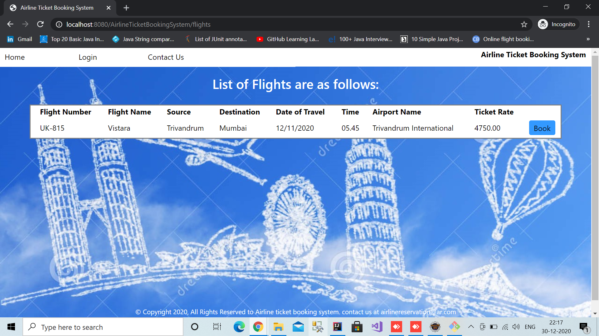

if no flights are available for the particular source, destination and date will navigate to flights not found page 

`book` button click navigates to login page
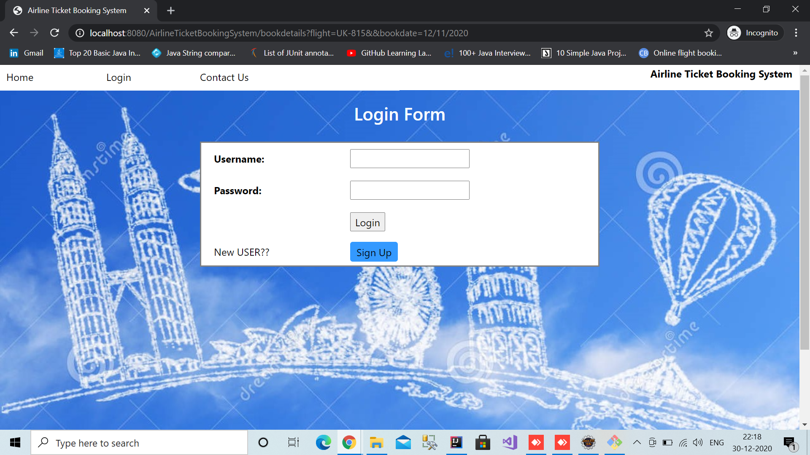

if invalid user shows no user found page

if new user navigate to Registration form(by clicking signin button) 
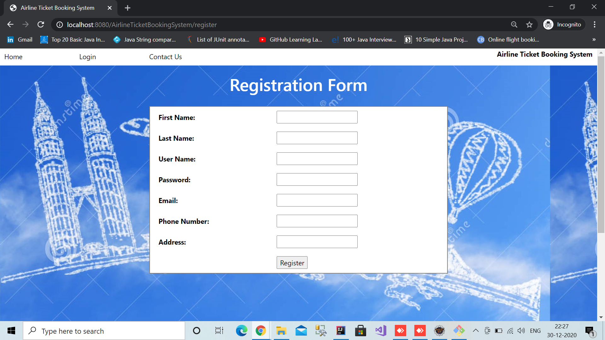

After login Completed it will navigates to booking details
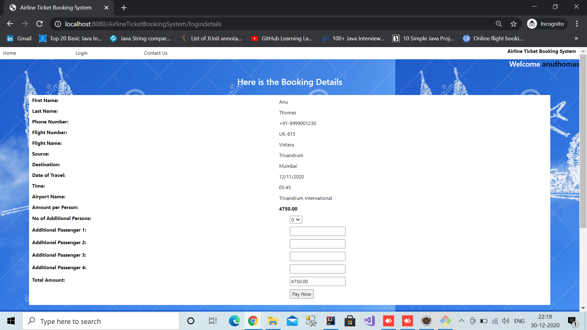

In booking details the user can add additional passengers information then it will automatically calculate the total amount to pay
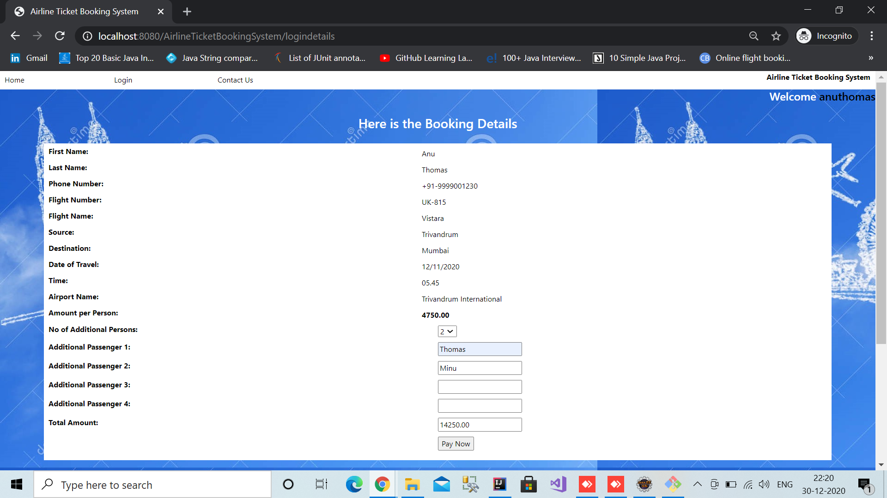

`pay now` button click will navigate to payment card detail page
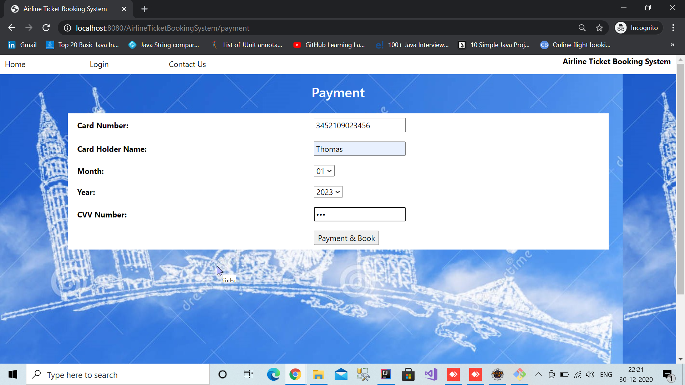
 
`payment and Book` button click will navigate to payment success page
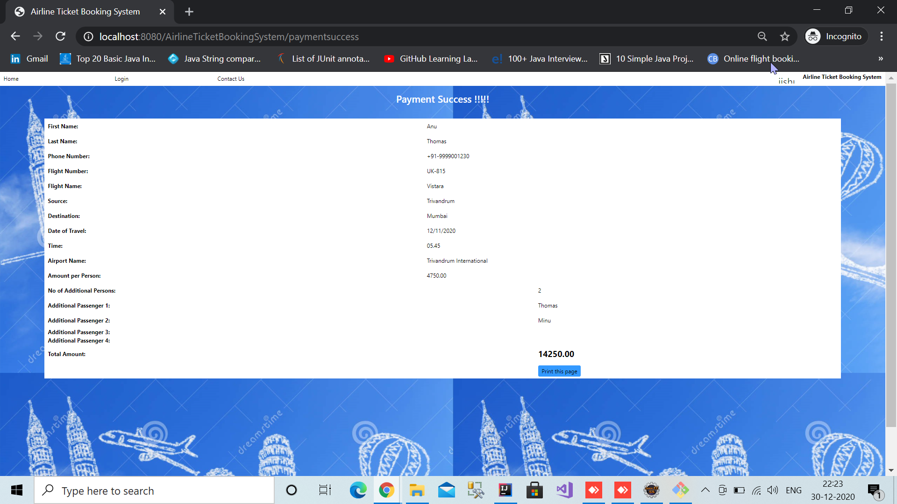

## screenshots of admin flow

Admin clicks on Home page navigation bar Login link it will navigate to login page. After login will display all the flights details. Admin can ADD/DELETE/UPDATE/CHART
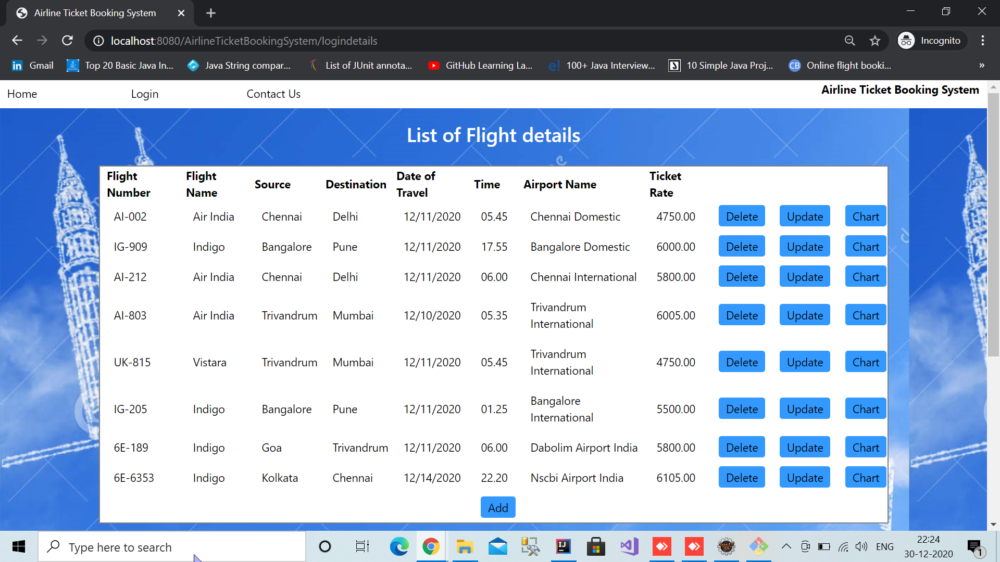

Admin clicks on `ADD` button 
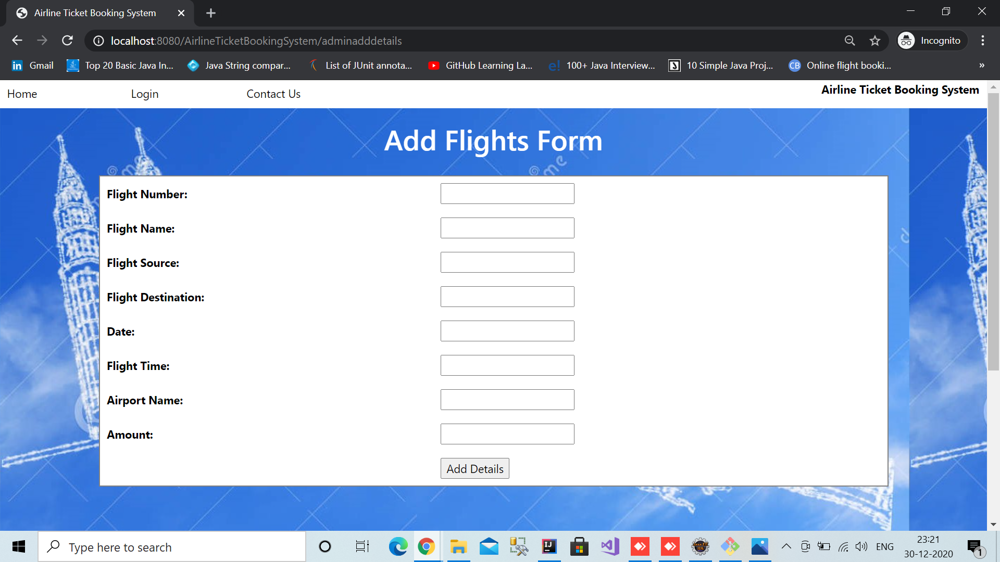

Admin clicks on `UPDATE` button, can update date, time and amount.
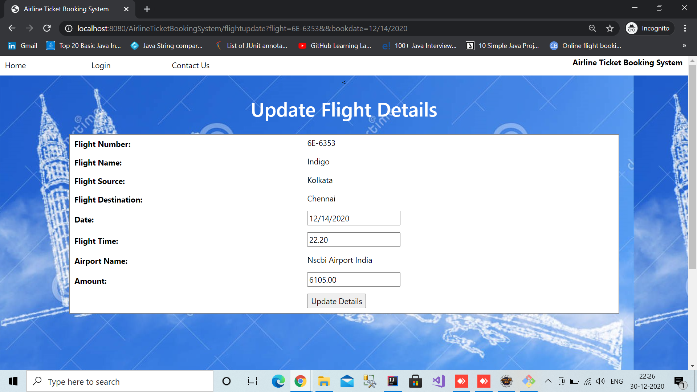

Admin clicks on `CHART` button
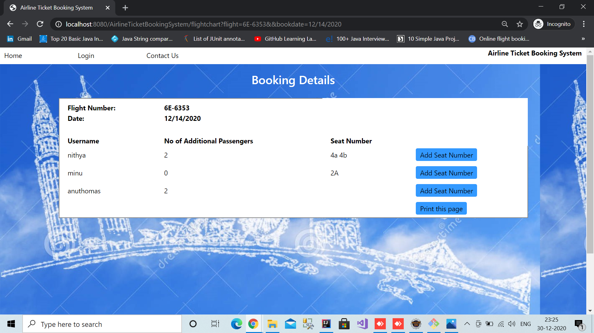

Admin can ADD/UPDATE the seat number
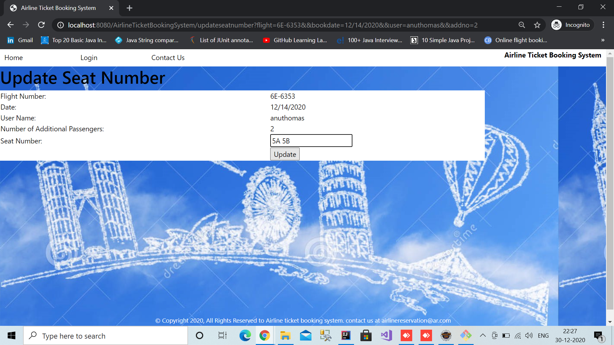

Admin can DELETE the flight details of specific flight
